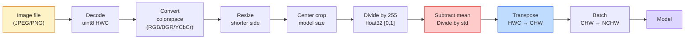
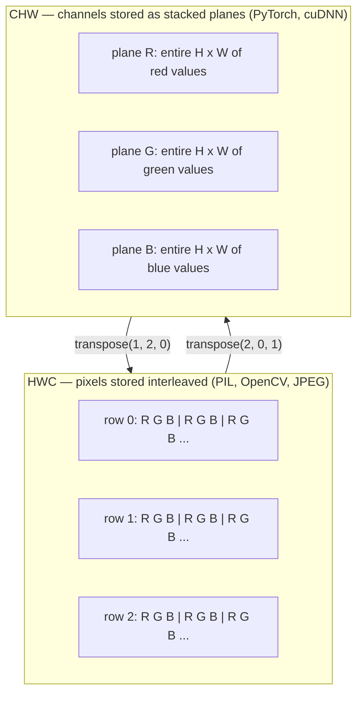

# أساسيات الصورة  البيكسلات، القنوات، المساحات اللونية

> الصورة هي عبارة عن عينة ضوئية كل نموذج رؤية ستستخدمها يبدأ من هذه الحقيقة

**Type:** Build
**Languages:** Python
**Prerequisites:** Phase 1 Lesson 12 (Tensor Operations), Phase 3 Lesson 11 (Intro to PyTorch)
**Time:** ~45 minutes

## أهداف التعلم

- شرح كيف يتم تحويل المشهد المستمر إلى بيكسل ولماذا تحدد قرارات العينات/الكميات السقف على كل نموذج متدفق
- قراءة، قطع، ومعاينة الصور كمتصفحات NumPy وتبديل بشكل متساوٍ بين تصميمات HWC و CHW
- تحويل بين RGB ، مقياس الرمادي ، HSV ، و YCbCr وتبرير لماذا يوجد كل مساحة لون
- تطبيق المعالجة المسبقة على مستوى البيكسل (تطبيق الطبيعية، وتوحيد، وتغيير الحجم، القناة الأولى) بالضبط كما يتوقع مشعل

## المشكلة

كل ورقة ستقرأها، كل وزن مسبق تمرين سوف تنزيل، كل API رؤية سوف تدعو يفترض تشفير محدد من المدخل.`uint8`الصورة حيث يريد النموذج `float32`وسوف لا يزال يعمل  وتنتج صامتًا القمامة. إطعام BGR إلى شبكة تدرب على RGB وتنهار الدقة بنسبة عشرة نقاط. تسلم نموذج القنوات - المدخل الأخير عندما يتوقع القنوات - أولاً وتعامل الطبقة الأولى من المكونات الارتفاع كقناة ميزة. لا شيء من هذا يلقي خطأ. إنه فقط يدمر قياساتك وتقضي أسبوعًا في البحث عن خطأ يعيش في كيفية تحميل الملف.

إن التخفيف ليس معقداً بمجرد معرفة ما يتدفق عليه. الجزء الصعب هو أن "الصورة" تعني أشياء مختلفة للكاميرا ، ومعبرة JPEG ، PIL ، OpenCV ، torchvision ، و kernel CUDA. لكل كومة ترتيب محور خاص بها ، ومدى البايت ، ومعاهدة القناة. مهندس الرؤية الذي لا يستطيع الحفاظ على هذه السفن المستقيمة مكسورة الأنابيب.

هذه الدروس تحدد الأساس حتى تتمكن بقية المرحلة من بناء عليه. في النهاية سوف تعرف ما هو البيكسل، لماذا هناك ثلاثة أرقام لكل بيكسل بدلا من واحد، ما "التطبيع مع إحصاءات ImageNet" في الواقع تفعل، وكيفية التحرك بين التخطيطين أو ثلاثة التي كل دروس أخرى في هذه المرحلة سوف تتخيل.

## المفهوم

### خط الأنابيب الكاملة من قبل المعالجة في نظرة واحدة

كل نظام رؤية الإنتاج هو نفس تسلسل من التحويلات العكسية. الحصول على خطوة واحدة خاطئة والنموذج يرى مدخل مختلف عن ما تم تدريب عليه.



الصناديق الحمراء والزرقاء هي حيث يعيش 80% من الفشل الصامت: غياب المعايير والترتيب الخطأ.

### البيكسل هو عينة، وليس مربع

يعد جهاز استشعار الكاميرا الفوتونات التي تهبط على شبكة من الكشفات الصغيرة. كل كشف يدمج الضوء لجزء من الثانية ويصدر ولتاجاً متناسباً مع عدد الكشفات التي تضربه. ثم يختفي جهاز الاستشعار هذا الجهد إلى عدد كامل. يصبح الكشف واحد بكسلًا واحدًا.

```
Continuous scene                 Sensor grid                     Digital image
(infinite detail)                (H x W detectors)               (H x W integers)

    ~~~~~                        +--+--+--+--+--+                 210 198 180 155 120
   ♪ ♪ 205 195 178 152 118 ♪
  - الضوء - - - - - - - - - - - - - - - - - - - - - - - - - - - - - - - - - - - - - - - - - - - - - - - - - - - - - - - - - - - - - - - - - - - - - - - - - - - - - - - - - - - - - - - - - - - - - - - - - - - - - - - - - - - - - - - - - - - - - - - - - - - - - - - - - - - - - - - - - - - - - - - - - - - - - - - - - - - - - - - - - - - - - - - - - - - - - - - - - - - - - - - - - - - - - - - - - - - - - - - - - - - - - - - - - - - - - - - - - - - - - - - - - - - - - - - - - - - - - - - - - - - - - - - - - - - - - - - - - - - - - - - - - - - - - - - - - - - - - - - - - - - - - - - - - - - - - - - - - - - - - - - - - - - - - - - - - - - - - - - - - - - - - - - - - - - - - - - - - - - - - - - - - - - - - - - - - - - - - - - - - - - - - - - - - - - - - - - - - - - - - - - - - - - - - - - - - - - - - - - - - - - - - - - - - - - - - - - - - - - - - - - - - - - - - - - - - - - - - - - - - - - - - - - - - - - - - - - - - - - - - - - - - - - - - - - - - - - - - - - - - - - - - - - - - - - - - - - - - - - - - - - - - - -
   ~~~~~                         |  |  |  |  |  |                 195 185 170 148 112
                                 +--+--+--+--+--+                 188 180 165 145 108
```

هناك خياران يحدثان في هذه الخطوة و يصلحان السقف على كل شيء أسفل النهر:

- **Spatial sampling**يقرر عدد الكشفات لكل درجة من المشهد. قليل جداً، والحواف تصبح متزينة (التخفيف). كثير جداً، وتنفجر التخزين والحساب.
- **Intensity quantization**يقرر كيفية تدفق الجهد. 8 بتات يعطي 256 مستوى وهو معيار للتعرض. 10، 12، 16 بتات يعطي تراجعات أكثر سلاسة ومادة للتصوير الطبي، HDR، وخطوط أنابيب الاستشعار الخام.

البيكسل ليس مربع ملون مع مساحة. إنه قياس واحد. عندما تقوم بتغيير الحجم أو التناوب، فإنك تقوم بإعادة أخذ عينات من شبكة القياس.

### لماذا ثلاثة قنوات

يحتسب أحد الكشفات الفوتونات عبر الطيف المرئي كله  وهو مستوى الرمادي. للحصول على اللون ، يغطي المستشعر الشبكة بمص mosaic من المرشحات الحمراء والخضراء والأزرق. بعد التمزيق ، كل موقع فضائي لديه ثلاثة أرقام كاملة: استجابة الكشف المصفاة بالحمر ، والمرشية المصفاة ، والزرقاء المصفاة بالقرب. هذه الأرقام الثلاثة هي ثلاثية RGB للبيكسل.

```
One pixel in memory:

    (R, G, B) = (210, 140, 30)   <- reddish-orange

An H x W RGB image:

    shape (H, W, 3)     stored as   H rows of W pixels of 3 values
                                    each in [0, 255] for uint8
```

ثلاثه ليست سحر. كاميرات العميقة تضيف قناة Z. تضيف الأقمار الصناعية الشرائط تحت الحمراء والأوترافيوليت. الاحصائيات الطبية غالباً ما يكون لها قناة واحدة (أشعة رين، CT) أو العديد (متطرفة). عدد القنوات هو المحور الأخير؛ وتعلم طبقات المكونات الاختلاط عبرها.

### اتفاقيتين للتخطيط: HWC و CHW

نفس العجلة، ترتيبان كل مكتبة تختار واحدة

```
HWC (height, width, channels)           CHW (channels, height, width)

   W ->                                    H ->
  +-----+-----+-----+                     +-----+-----+
H |R G B|R G B|R G B|                   C |R R R R R R|
| +-----+-----+-----+                   | +-----+-----+
v |R G B|R G B|R G B|                   v |G G G G G G|
  +-----+-----+-----+                     +-----+-----+
                                          |B B B B B B|
                                          +-----+-----+

   PIL, OpenCV, matplotlib,              PyTorch, most deep learning
   almost every image file on disk       frameworks, cuDNN kernels
```

توجد CHW لأن نواة التخزين تتحرك عبر H و W. الحفاظ على محور القناة أولا يعني أن كل نواة ترى طائرة 2D متواصلة لكل قناة ، والتي تنقل نظيفة. تنظم شكلات القرص HWC لأن ذلك يطابق كيفية خروج خطوط المسح من جهاز استشعار.

تحويل خط واحد سوف تكتب ألف مرة:

```
img_chw = img_hwc.transpose(2, 0, 1)      # NumPy
img_chw = img_hwc.permute(2, 0, 1)        # PyTorch tensor
```

ترتيب الذاكرة، مرئية:



### نطاقات البايت و dtype

ثلاث اتفاقات تهيمن على:

| Convention | dtype | Range | Where you see it |
|------------|-------|-------|------------------|
| Raw | `uint8` | [0, 255] | Files on disk, PIL, OpenCV output |
| Normalized | `float32` | [0.0, 1.0] | After `img.astype('float32') / 255` |
| Standardized | `float32` | roughly [-2, +2] | After subtracting mean and dividing by std |

تم تدريب الشبكات المتحركة على المدخلات الموحدة.`mean=[0.485, 0.456, 0.406]`،`std=[0.229, 0.224, 0.225]`هي المتوسط الحسابي والانحراف القياسي للقنوات الثلاث على مجموعة تدريب ImageNet الكاملة ، المحاسبة على [0, 1] البيكسلات المعتادة.`uint8`في نموذج يتوقع العبث الموحد هو الفشل الصامت الأكثر شيوعا في الرؤية التطبيقية.

### المساحات الملونية و لماذا توجد

RGB هو شكل التقاط ولكن ليس دائماً هو التمثيل الأكثر فائدة لنموذج.

```
 RGB               HSV                       YCbCr / YUV

 R red             H hue (angle 0-360)       Y luminance (brightness)
 G green           S saturation (0-1)        Cb chroma blue-yellow
 B blue            V value/brightness (0-1)  Cr chroma red-green

 Linear to         Separates color from      Separates brightness from
 sensor output     brightness. Useful for    color. JPEG and most video
                   color thresholding, UI    codecs compress the chroma
                   sliders, simple filters   channels harder because the
                                             human eye is less sensitive
                                             to chroma detail than to Y.
```

معظم قنوات التلفزيون الحديثة تقوم بتغذية RGB وتلتقي بمناطق أخرى عندما:

- **HSV** رمز سيرته الذاتية الكلاسيكي، التقسيم القائم على الألوان، التوازن البيضاء.
- **YCbCr**قراءة محطات JPEG الداخلية، خطوط أنابيب الفيديو، نماذج عالية القرار التي تعمل على Y فقط.
- **Grayscale** OCR، نماذج الوثائق، أي حالة حيث يكون اللون متغيرًا في المضايقة بدلاً من الإشارة.

مقياس الرمادي من RGB هو مبلغ معين، وليس متوسط، لأن العين البشرية أكثر حساسية للخضراء من الأحمر أو الأزرق:

```
Y = 0.299 R + 0.587 G + 0.114 B       (ITU-R BT.601, the classic weights)
```

### نسبة الجوانب، وإعادة الحجم، والتربية

كل نموذج لديه حجم مدخل ثابت (224 × 224 بالنسبة لمعظم تصنيفات ImageNet ، 384 × 384 أو 512 × 512 بالنسبة للمكشفات الحديثة). نادرا ما تتطابق الصور. الخيارات الثلاثة لتحديد الحجم التي تهم:

- **Resize shorter side, then center crop**وصفة ImageNet القياسية. يحافظ على نسبة الجانب، يرمي شريط من البيكسلات الحافة.
- **Resize and pad** يحافظ على نسبة الجانب وكل بكسل، يضيف شريطا أسود.
- **Resize directly to target** يمتد الصورة. رخيص، يلتهم الهندسة، جيد للعديد من مهام التصنيف.

طريقة التقاطع تحدد كيفية حساب البيكسلات المتوسطة عندما لا تتوافق الشبكة الجديدة مع الشبكة القديمة:

```
Nearest neighbour     fastest, blocky, only choice for masks/labels
Bilinear              fast, smooth, default for most image resizing
Bicubic               slower, sharper on upscaling
Lanczos               slowest, best quality, used for final display
```

قاعدة الإبهام: مليونيرية للتدريب، ثنائي مكعب أو لانسوز للأصول التي ستنظر إليها، أقرب لأي شيء يحتوي على هويات فئة الأعداد الكاملة.

```figure
conv-output-size
```

## بناءها

### الخطوة الأولى: قم بتحميل صورة وتفحص شكلها

استخدم Pillow لتحميل أي JPEG أو PNG، وتحويل إلى NumPy، وتطبيق ما لديك.

```python
import numpy as np
from PIL import Image

def synthetic_rgb(h=128, w=192, seed=0):
    rng = np.random.default_rng(seed)
    yy, xx = np.meshgrid(np.linspace(0, 1, h), np.linspace(0, 1, w), indexing="ij")
    r = (np.sin(xx * 6) * 0.5 + 0.5) * 255
    g = yy * 255
    b = (1 - yy) * xx * 255
    rgb = np.stack([r, g, b], axis=-1) + rng.normal(0, 6, (h, w, 3))
    return np.clip(rgb, 0, 255).astype(np.uint8)

arr = synthetic_rgb()
# Or load from disk:
# arr = np.asarray(Image.open("your_image.jpg").convert("RGB"))

print(f"type:   {type(arr).__name__}")
print(f"dtype:  {arr.dtype}")
print(f"shape:  {arr.shape}     # (H, W, C)")
print(f"min:    {arr.min()}")
print(f"max:    {arr.max()}")
print(f"pixel at (0, 0): {arr[0, 0]}")
```

الناتج المتوقع: `shape: (H, W, 3)`،`dtype: uint8`، نطاق`[0, 255]`هذا هو التمثيل القنوني على القرص سواء كانت البايتات تأتي من كاميرا، أو مُشعّر JPEG، أو مولد صناعي.

### الخطوة الثانية: تقسيم القنوات وإعادة ترتيب التخطيط

سحب R، G، B بشكل منفصل، ثم تحويل من HWC إلى CHW ل PyTorch.

```python
R = arr[:, :, 0]
G = arr[:, :, 1]
B = arr[:, :, 2]
print(f"R shape: {R.shape}, mean: {R.mean():.1f}")
print(f"G shape: {G.shape}, mean: {G.mean():.1f}")
print(f"B shape: {B.shape}, mean: {B.mean():.1f}")

arr_chw = arr.transpose(2, 0, 1)
print(f"\nHWC shape: {arr.shape}")
print(f"CHW shape: {arr_chw.shape}")
```

ثلاث طوابق على نطاق الرمادي، واحدة لكل قناة. CHW فقط إعادة ترتيب المحورات؛ لا توجد نسخة بيانات مطلوبة بشكل صارم عندما يسمح بتخطيط الذاكرة بذلك.

### الخطوة الثالثة: تحويلات على مستوى الرمادي و HSV

مقياس الرمادي الموزن، ثم تقييم اليدوي RGB إلى HSV.

```python
def rgb_to_grayscale(rgb):
    weights = np.array([0.299, 0.587, 0.114], dtype=np.float32)
    return (rgb.astype(np.float32) @ weights).astype(np.uint8)

def rgb_to_hsv(rgb):
    rgb_f = rgb.astype(np.float32) / 255.0
    r, g, b = rgb_f[..., 0], rgb_f[..., 1], rgb_f[..., 2]
    cmax = np.max(rgb_f, axis=-1)
    cmin = np.min(rgb_f, axis=-1)
    delta = cmax - cmin

    h = np.zeros_like(cmax)
    mask = delta > 0
    rmax = mask & (cmax == r)
    gmax = mask & (cmax == g)
    bmax = mask & (cmax == b)
    h[rmax] = ((g[rmax] - b[rmax]) / delta[rmax]) % 6
    h[gmax] = ((b[gmax] - r[gmax]) / delta[gmax]) + 2
    h[bmax] = ((r[bmax] - g[bmax]) / delta[bmax]) + 4
    h = h * 60.0

    s = np.where(cmax > 0, delta / cmax, 0)
    v = cmax
    return np.stack([h, s, v], axis=-1)

gray = rgb_to_grayscale(arr)
hsv = rgb_to_hsv(arr)
print(f"gray shape: {gray.shape}, range: [{gray.min()}, {gray.max()}]")
print(f"hsv   shape: {hsv.shape}")
print(f"hue range: [{hsv[..., 0].min():.1f}, {hsv[..., 0].max():.1f}] degrees")
print(f"sat range: [{hsv[..., 1].min():.2f}, {hsv[..., 1].max():.2f}]")
print(f"val range: [{hsv[..., 2].min():.2f}, {hsv[..., 2].max():.2f}]")
```

Hue يخرج في درجات، والشباعة والقيمة في [0, 1]. وهذا يطابق OpenCV `hsv_full`الإتفاقية

### الخطوة الرابعة: تعديل، وتعديل

اذهب من البايتات الخام إلى الجهاز المحدد الذي يتوقعه نموذج ImageNet المُتدرب مسبقاً ثم عود

```python
mean = np.array([0.485, 0.456, 0.406], dtype=np.float32)
std = np.array([0.229, 0.224, 0.225], dtype=np.float32)

def preprocess_imagenet(rgb_uint8):
    x = rgb_uint8.astype(np.float32) / 255.0
    x = (x - mean) / std
    x = x.transpose(2, 0, 1)
    return x

def deprocess_imagenet(chw_float32):
    x = chw_float32.transpose(1, 2, 0)
    x = x * std + mean
    x = np.clip(x * 255.0, 0, 255).astype(np.uint8)
    return x

x = preprocess_imagenet(arr)
print(f"preprocessed shape: {x.shape}     # (C, H, W)")
print(f"preprocessed dtype: {x.dtype}")
print(f"preprocessed mean per channel:  {x.mean(axis=(1, 2)).round(3)}")
print(f"preprocessed std  per channel:  {x.std(axis=(1, 2)).round(3)}")

roundtrip = deprocess_imagenet(x)
max_diff = np.abs(roundtrip.astype(int) - arr.astype(int)).max()
print(f"roundtrip max pixel diff: {max_diff}    # should be 0 or 1")
```

يجب أن يكون متوسط كل قناة قريبًا من الصفر ، std قريبًا من واحد. زوج التحكم / التخفيض هو بالضبط ما يفعله كل مشعل`transforms.Normalize`المكالمة تعمل تحت الغطاء

### الخطوة 5: قم بإعادة الحجم باستخدام ثلاث طرق إقطاع

مقارنة أقرب، مليوني، و ثنائي الكوب على مقياس عالي حتى يكون الفرق مرئي.

```python
target = (arr.shape[0] * 3, arr.shape[1] * 3)

nearest = np.asarray(Image.fromarray(arr).resize(target[::-1], Image.NEAREST))
bilinear = np.asarray(Image.fromarray(arr).resize(target[::-1], Image.BILINEAR))
bicubic = np.asarray(Image.fromarray(arr).resize(target[::-1], Image.BICUBIC))

def local_roughness(x):
    gy = np.diff(x.astype(float), axis=0)
    gx = np.diff(x.astype(float), axis=1)
    return float(np.abs(gy).mean() + np.abs(gx).mean())

for name, out in [("nearest", nearest), ("bilinear", bilinear), ("bicubic", bicubic)]:
    print(f"{name:>8}  shape={out.shape}  roughness={local_roughness(out):6.2f}")
```

أقرب نقاط أعلى على الخشعة لأنه يحافظ على الحواف الصلبة. بلينير هو الأكثر سلاسة. بيكوبيك يجلس في المنتصف، الحفاظ على الحادة الملاحظة دون آثار خطوات السلم.

## استخدمها

`torchvision.transforms`يجمع كل شيء أعلاه في خط أنابيب واحد يمكن تركيبه.`preprocess_imagenet`نعم، بالإضافة إلى الحجم والحصول.

```python
import torch
from torchvision import transforms
from PIL import Image

img = Image.fromarray(synthetic_rgb(256, 256))

pipeline = transforms.Compose([
    transforms.Resize(256),
    transforms.CenterCrop(224),
    transforms.ToTensor(),
    transforms.Normalize(mean=[0.485, 0.456, 0.406], std=[0.229, 0.224, 0.225]),
])

x = pipeline(img)
print(f"tensor type:  {type(x).__name__}")
print(f"tensor dtype: {x.dtype}")
print(f"tensor shape: {tuple(x.shape)}      # (C, H, W)")
print(f"per-channel mean: {x.mean(dim=(1, 2)).tolist()}")
print(f"per-channel std:  {x.std(dim=(1, 2)).tolist()}")

batch = x.unsqueeze(0)
print(f"\nbatched shape: {tuple(batch.shape)}   # (N, C, H, W) — ready for a model")
```

أربعة خطوات، في هذا الترتيب الدقيق:`Resize(256)`يُقَدِّم الجانب الأقصر إلى 256 `CenterCrop(224)`يأخذ مساحة 224 × 224 من الوسط`ToTensor()`تقسم بـ 255 وتبادل HWC إلى CHW`Normalize`يخص متوسط ImageNet ويقسمه ب std. عكس هذا الترتيب يغير بصمت ما يصل إلى النموذج.

## أرسله

هذا الدرس ينتج عن:

- `outputs/prompt-vision-preprocessing-audit.md` طلب يحول أي بطاقة نموذج أو بطاقة مجموعة بيانات إلى قائمة تفتيش للمعدلات المتبقية المحددة التي يجب أن يحتفظ بها الفريق.
- `outputs/skill-image-tensor-inspector.md` مهارة التي، بالنظر إلى أي تنصر أو صف تشكل الصورة، تقرير dtype، التخطيط، النطاق، وما إذا كان يبدو خام، عادي، أو قياسية.

## التمارين

1. **(Easy)**تحميل JPEG مع OpenCV (`cv2.imread`) و مع وسادة. طبع كل من الشكليات والبيكسل في `(0, 0)`. شرح الفرق بين القناة والترتيب ، ثم كتابة تحويل خط واحد يجعل صف OpenCV متطابقة مع وسادة واحدة.
2. **(Medium)**اكتب`standardize(img, mean, std)`و العكس الذي يمر معاً`roundtrip_max_diff <= 1`يجب أن تعمل وظائفك على صورة واحدة في HWC وعلى مجموعة في NCHW مع نفس المكالمة.
3. **(Hard)**خذ ثلاث قنوات ImageNet الموحد التنسور وتشغيله من خلال 1x1 Conv الذي يتعلم مزيج وزنه من RGB في قناة واحدة على نطاق الرمادي.`[0.299, 0.587, 0.114]`، تجميدهم ، وتحقق من ان المخرج يطابق دليلك`rgb_to_grayscale`ما هي التحوّلات الكلاسيكية الأخرى في الفضاء اللونية التي يمكن كتابتها كتحوّل 1x1؟

## الشروط الرئيسية

| Term | What people say | What it actually means |
|------|----------------|----------------------|
| Pixel | "A coloured square" | One sample of light intensity at one grid location — three numbers for colour, one for grayscale |
| Channel | "The colour" | One of the parallel spatial grids stacked into an image tensor; last axis in HWC, first in CHW |
| HWC / CHW | "The shape" | Axis orderings for an image tensor; disk and PIL use HWC, PyTorch and cuDNN use CHW |
| Normalize | "Scale the image" | Divide by 255 so pixels live in [0, 1] — necessary but not sufficient |
| Standardize | "Zero-center" | Subtract mean and divide by std per channel so the input distribution matches what the model was trained on |
| Grayscale conversion | "Average the channels" | A weighted sum with coefficients 0.299/0.587/0.114 that matches human luminance perception |
| Interpolation | "How resize picks pixels" | The rule that decides output values when the new grid does not align with the old one — nearest for labels, bilinear for training, bicubic for display |
| Aspect ratio | "Width over height" | The ratio that distinguishes "resize and pad" from "resize and stretch" |

## المزيد من القراءة

- [Charles Poynton — A Guided Tour of Color Space](https://poynton.ca/PDFs/Guided_tour.pdf) أكثر التعاملات الفنية وضوحا لماذا هناك العديد من المساحات اللونية ومتى كل واحدة مهمة
- [PyTorch Vision Transforms Docs](https://pytorch.org/vision/stable/transforms.html) أنبوب كامل من التحويلات سوف تكوين في الواقع في الإنتاج
- [How JPEG Works (Colt McAnlis)](https://www.youtube.com/watch?v=F1kYBnY6mwg) جولة بصرية حادة من خريطة الكروم، DCT، ولماذا JPEG ترمز YCbCr بدلا من RGB
- [ImageNet Preprocessing Conventions (torchvision models)](https://pytorch.org/vision/stable/models.html)مصدر الحقيقة`mean=[0.485, 0.456, 0.406]`و لماذا كل نموذج في حديقة الحيوان يتوقع ذلك
