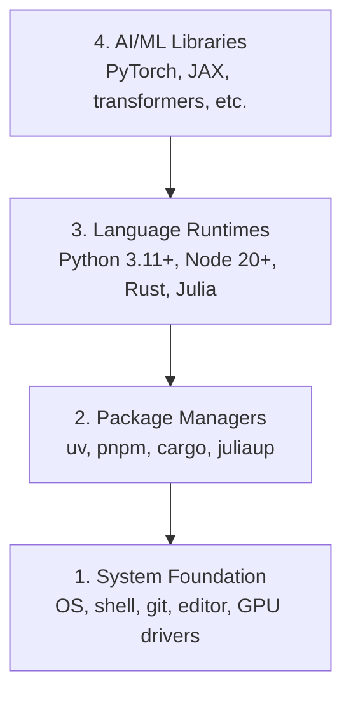

# Medio ambiente de desarrollo

> Sus herramientas dan forma a su pensamiento.

**Type:** Build
**Languages:** Python, Node.js, Rust
**Prerequisites:** None
**Time:** ~45 minutes

## Objetivos de aprendizaje

- Configure Python 3.11+, Node.js 20+, y cadenas de herramientas Rust desde cero
- Configurar entornos virtuales y administradores de paquetes para edificaciones reproducibles
- Verificar el acceso de la GPU con CUDA/MPS y ejecutar una operación de tensor de prueba
- Comprender la pila de cuatro capas: sistema, paquetes, tiempos de ejecución, bibliotecas de IA

## El problema

Estás a punto de aprender ingeniería de IA en más de 200 clases usando Python, TypeScript, Rust y Julia. Si tu entorno se rompe, cada lección se convierte en una lucha contra la herramienta en lugar de aprender.

La mayoría de la gente omite la configuración del entorno y luego pasa horas debujando errores de importación, conflictos de versiones y controladores de CUDA faltantes.

## El concepto

Un entorno de ingeniería de IA tiene cuatro capas:



Installamos abajo arriba. Cada capa depende de la que está debajo de ella.

```figure
s0-env-stack
```

## Construye el mismo

### Paso 1: Fundamento del sistema

Compruebe su sistema e instale los elementos básicos.

```bash
# macOS
xcode-select --install
brew install git curl wget

# Ubuntu/Debian
sudo apt update && sudo apt install -y build-essential git curl wget

# Windows (use WSL2)
wsl --install -d Ubuntu-24.04
```

### Paso 2: Python con UV

Usamos`uv`Es 10-100 veces más rápido que pip y maneja entornos virtuales automáticamente.

```bash
curl -LsSf https://astral.sh/uv/install.sh | sh

uv python install 3.12

uv venv
source .venv/bin/activate  # or .venv\Scripts\activate on Windows

uv pip install numpy matplotlib jupyter
```

Verifique:

```python
import sys
print(f"Python {sys.version}")

import numpy as np
print(f"NumPy {np.__version__}")
a = np.array([1, 2, 3])
print(f"Vector: {a}, dot product with itself: {np.dot(a, a)}")
```

### Paso 3: Node.js con pnpm

Para clases de TypeScript (agentes, servidores MCP, aplicaciones web).

```bash
curl -fsSL https://fnm.vercel.app/install | bash
fnm install 22
fnm use 22

npm install -g pnpm

node -e "console.log('Node', process.version)"
```

**macOS / Apple Silicon (M1/M2/M3/M4):**Si el instalador deja de instalar `Error: Cannot install under Rosetta 2 in ARM default prefix (/opt/homebrew)`, su terminal está funcionando bajo Rosetta 2 (`arch`huellas`i386`Instálle el arm64 forzador de fnm, cablealo en su caparazón, y luego vuelva a ejecutar los comandos anteriores desde `fnm install 22`¿Qué es esto ?

```bash
arch -arm64 brew install fnm
echo 'eval "$(fnm env --use-on-cd)"' >> ~/.zshrc
source ~/.zshrc
```

### Paso 4: Corrosidad

Para las lecciones críticas al rendimiento (inferencia, sistemas).

```bash
curl --proto '=https' --tlsv1.2 -sSf https://sh.rustup.rs | sh

rustc --version
cargo --version
```

### Paso 5: Julia (opcional)

Para clases de matemáticas pesadas donde Julia brilla.

```bash
curl -fsSL https://install.julialang.org | sh

julia -e 'println("Julia ", VERSION)'
```

### Paso 6: Configuración de GPU (si tiene uno)

**NVIDIA (Linux / Windows):**

```bash
nvidia-smi

# Install PyTorch with CUDA
uv pip install torch torchvision torchaudio --index-url https://download.pytorch.org/whl/cu124
```

**macOS / Apple Silicon (M1/M2/M3/M4):**No hay CUDA en un Mac que se espera, no un fracaso.**not**Pasé .`--index-url .../cuXXX`(aquellas ruedas son solo Linux / Windows, por lo que la instalación falla). Instale la construcción simple, que incluye el backend de la GPU MPS (Metal) de Apple:

```bash
uv pip install torch torchvision torchaudio
```

Verificar (funciona en cualquier plataforma):

```python
import torch
print(f"CUDA available: {torch.cuda.is_available()}")           # False on macOS — expected
print(f"MPS available:  {torch.backends.mps.is_available()}")   # True on Apple Silicon
if torch.cuda.is_available():
    print(f"GPU: {torch.cuda.get_device_name(0)}")
```

No hay GPU? No hay problema. La mayoría de las clases funcionan en CPU. Para las clases pesadas de entrenamiento, utilice Google Colab o GPUs en la nube.

### Paso 7: Verifique todo

Ejecutar el guión de verificación:

```bash
python phases/00-setup-and-tooling/01-dev-environment/code/verify.py
```

## Usalo

Su entorno está listo para cada lección de este curso.

| Language | Used In | Package Manager |
|----------|---------|-----------------|
| Python | Phases 1-12 (ML, DL, NLP, Vision, Audio, LLMs) | uv |
| TypeScript | Phases 13-17 (Tools, Agents, Swarms, Infra) | pnpm |
| Rust | Phases 12, 15-17 (Performance-critical systems) | cargo |
| Julia | Phase 1 (Math foundations) | Pkg |

## Envío

Esta lección produce un guión de verificación que cualquiera puede ejecutar para comprobar su configuración.

¿ Qué ?`outputs/prompt-env-check.md`para una respuesta que ayuda a los asistentes de IA a diagnosticar problemas ambientales.

## Los ejercicios

1. Ejecutar el guión de verificación y corregir cualquier falla
2. Crear un entorno virtual Python para este curso e instalar PyTorch
3. Escriba un "hola mundo" en los cuatro idiomas y ejecuta cada uno
