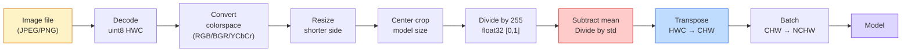
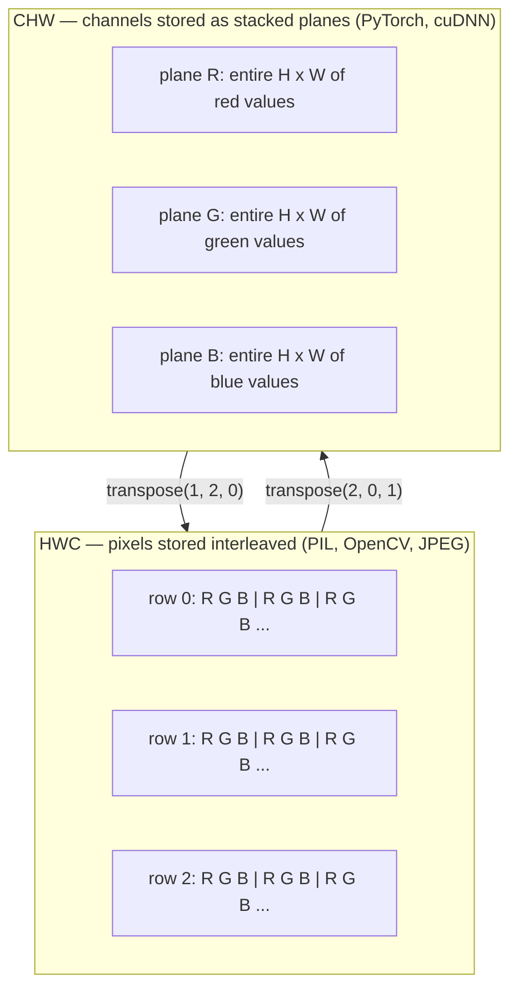

# छवि मूल बातें  पिक्सेल, चैनल, रंग स्थान

> एक छवि प्रकाश के नमूने का एक tensor है. हर दृष्टि मॉडल आप कभी भी उपयोग करेंगे इस एक तथ्य से शुरू होता है.

**Type:** Build
**Languages:** Python
**Prerequisites:** Phase 1 Lesson 12 (Tensor Operations), Phase 3 Lesson 11 (Intro to PyTorch)
**Time:** ~45 minutes

## सीखने के लक्ष्य

- यह समझाएं कि एक निरंतर दृश्य कैसे पिक्सेल में विवश हो जाता है और नमूना/क्वांटिकेशन निर्णय प्रत्येक डाउनस्ट्रीम मॉडल पर सीमा क्यों निर्धारित करते हैं
- NumPy सरणी के रूप में छवियों को पढ़ें, स्लाइस करें और निरीक्षण करें और HWC और CHW लेआउट के बीच धाराप्रवाह स्विच करें
- आरजीबी, ग्रेस्केल, एचएसवी और वाईसीबीसीआर के बीच परिवर्तित करें और प्रत्येक रंग स्थान का अस्तित्व क्यों है, इसका कारण बताएं
- पिक्सेल स्तर पर पूर्व प्रसंस्करण (मानक, मानकीकृत, आकार बदलने, चैनल-पहले) लागू करें ठीक उसी तरह जैसे टॉर्चविजन इसकी उम्मीद करता है

## समस्या

आप जो भी पेपर पढ़ेंगे, जो भी वजन आप डाउनलोड करेंगे, जो भी विजन एपीआई आप कॉल करेंगे, वह इनपुट का एक विशिष्ट एन्कोडिंग मानता है।`uint8`छवि जहां मॉडल चाहता है `float32`और यह अभी भी चल रहा है  और चुपचाप कचरा उत्पन्न करेगा। आरजीबी पर प्रशिक्षित नेटवर्क को बीजीआर खिलाएं और सटीकता दस अंक से गिर जाती है। एक मॉडल चैनल-अंतिम इनपुट जब यह चैनलों की उम्मीद करता है-पहले और पहले कन्व परत ऊंचाई को एक सुविधा चैनल के रूप में मानती है। इनमें से कोई भी त्रुटि नहीं डालता है। यह सिर्फ आपके मीट्रिक को बर्बाद करता है और आप एक सप्ताह की खोज में बिताते हैं जो उस बग के लिए रहता है जो आपने फ़ाइल को लोड किया है।

एक संभलना जटिल नहीं है जब आप जानते हैं कि यह क्या स्लाइड कर रहा है। कठिन हिस्सा यह है कि "एक छवि" का मतलब कैमरा, एक जेपीईजी डिकोडर, पीआईएल, ओपनसीवी, टॉर्चविजन और एक क्यूडीए कर्नेल के लिए अलग-अलग चीजें हैं। प्रत्येक स्टैक का अपना अक्ष क्रम, बाइट रेंज और चैनल सम्मेलन है। एक दृष्टि इंजीनियर जो इन सीधी जहाजों को टूटी हुई पाइपलाइन नहीं रख सकता है।

इस पाठ में नींव तय की गई है ताकि शेष चरण उस पर बना सकें। अंत तक आप जानेंगे कि पिक्सेल क्या है, एक के बजाय प्रत्येक पिक्सेल में तीन संख्याएं क्यों हैं, "इमेजनेट आँकड़े के साथ सामान्यीकरण" वास्तव में क्या करता है, और इस चरण में प्रत्येक अन्य पाठ के रूप में दो या तीन लेआउट के बीच कैसे स्थानांतरित किया जाए।

## अवधारणा

### एक नज़र में पूरी प्रीप्रोसेसिंग पाइपलाइन

प्रत्येक उत्पादन दृष्टि प्रणाली एक ही क्रम में परिवर्तनीय परिवर्तन है. एक कदम गलत हो जाता है और मॉडल यह प्रशिक्षित किया गया था की तुलना में एक अलग इनपुट देखता है.



लाल और नीले दो बक्से 80% मौन विफलताओं के लिए रहते हैंः मानककरण की कमी और गलत लेआउट।

### एक पिक्सेल एक नमूना है, एक वर्ग नहीं

कैमरा सेंसर छोटे डिटेक्टरों के ग्रिड पर उतरने वाले फोटॉन की गिनती करता है। प्रत्येक डिटेक्टर सेकंड के एक अंश के लिए प्रकाश को एकीकृत करता है और उस पर कितने फोटॉन के साथ अनुपात में एक वोल्टेज उत्सर्जित करता है। सेंसर फिर उस वोल्टेज को एक पूर्णांक में विघटित करता है। एक डिटेक्टर एक पिक्सेल बन जाता है।

```
Continuous scene                 Sensor grid                     Digital image
(infinite detail)                (H x W detectors)               (H x W integers)

    ~~~~~                        +--+--+--+--+--+                 210 198 180 155 120
   ♪ ♪ ♪ मैं एक आदमी हूँ ♪ ♪ मैं एक आदमी हूँ ♪ ♪ मैं एक आदमी हूँ ♪
  ~ प्रकाश ~ ----> +--+--+--+--+--+--+----> 200 190 175 150 115
   ~~~~~                         |  |  |  |  |  |                 195 185 170 148 112
                                 +--+--+--+--+--+                 188 180 165 145 108
```

इस चरण में दो विकल्प होते हैं और वे नीचे की ओर सब कुछ पर छत तयः

- **Spatial sampling**यह तय करता है कि दृश्य के डिग्री के प्रति कितने डिटेक्टर हैं। बहुत कम, और किनारे जगे हुए हो जाते हैं (अलिज़िंग) । बहुत अधिक, और भंडारण और गणना विस्फोट।
- **Intensity quantization**8 बिट्स 256 स्तर देता है और प्रदर्शन के लिए मानक है। 10, 12, 16 बिट्स चिकित्सा इमेजिंग, एचडीआर और कच्चे सेंसर पाइपलाइन के लिए चिकनी ग्रेडिएंट और सामग्री प्रदान करते हैं।

पिक्सेल एक रंगीन वर्ग नहीं है जिसमें क्षेत्रफल है. यह एक मात्र माप है. जब आप आकार बदलते हैं या घूमते हैं, तो आप उस माप ग्रिड को फिर से नमूना दे रहे हैं।

### तीन चैनल क्यों

एक डिटेक्टर पूरे दृश्यमान स्पेक्ट्रम पर फोटॉन गिनता है जो ग्रे स्केल है। रंग प्राप्त करने के लिए, सेंसर लाल, हरे और नीले फिल्टर के एक मोज़ेक के साथ ग्रिड को कवर करता है। डेमोसाइक करने के बाद, प्रत्येक स्थानिक स्थान में तीन पूर्णांक होते हैंः लाल-फिल्टर्ड डिटेक्टर की प्रतिक्रिया, हरे-फिल्टर्ड और नीले-फिल्टर्ड पास में। ये तीन पूर्णांक एक पिक्सेल के आरजीबी ट्रिपल हैं।

```
One pixel in memory:

    (R, G, B) = (210, 140, 30)   <- reddish-orange

An H x W RGB image:

    shape (H, W, 3)     stored as   H rows of W pixels of 3 values
                                    each in [0, 255] for uint8
```

तीन जादू नहीं है। गहराई कैमरे एक Z चैनल जोड़ते हैं। उपग्रह इन्फ्रारेड और पराबैंगनी बैंड जोड़ते हैं। चिकित्सा स्कैन में अक्सर एक चैनल (एक्स-रे, सीटी) या कई (हाइपरस्पेक्ट्रल) होते हैं। चैनलों की संख्या अंतिम अक्ष है; कन्व परतें इसके पार मिश्रण करना सीखती हैं।

### दो लेआउट सम्मेलनः एचडब्ल्यूसी और सीएचडब्ल्यू

एक ही tensor, दो क्रम. हर पुस्तकालय एक चुनता है.

```
HWC (height, width, channels)           CHW (channels, height, width)

   W ->                                    H ->
  +-----+-----+-----+                     +-----+-----+
H |R G B|R G B|R G B|                   C |R R R R R R|
| +-----+-----+-----+                   | +-----+-----+
v |R G B|R G B|R G B|                   v |G G G G G G|
  +-----+-----+-----+                     +-----+-----+
                                          |B B B B B B|
                                          +-----+-----+

   PIL, OpenCV, matplotlib,              PyTorch, most deep learning
   almost every image file on disk       frameworks, cuDNN kernels
```

CHW इसलिए मौजूद है क्योंकि घुमावदार कर्नेल H और W के पार स्लाइड करते हैं। चैनल अक्ष को पहले रखने का मतलब है कि प्रत्येक कर्नेल प्रत्येक चैनल पर एक आसन्न 2D विमान देखता है, जो साफ वेक्टरिज़ करता है। डिस्क प्रारूप HWC को बनाए रखते हैं क्योंकि यह एक सेंसर से स्कैनलाइनों के बाहर आने के तरीके से मेल खाता है।

एक पंक्ति रूपांतरण आप एक हजार बार टाइप करेंगेः

```
img_chw = img_hwc.transpose(2, 0, 1)      # NumPy
img_chw = img_hwc.permute(2, 0, 1)        # PyTorch tensor
```

स्मृति लेआउट, दृश्यमानः



### बाइट रेंज और dtype

तीन महामहिमों में प्रमुखता हैः

| Convention | dtype | Range | Where you see it |
|------------|-------|-------|------------------|
| Raw | `uint8` | [0, 255] | Files on disk, PIL, OpenCV output |
| Normalized | `float32` | [0.0, 1.0] | After `img.astype('float32') / 255` |
| Standardized | `float32` | roughly [-2, +2] | After subtracting mean and dividing by std |

कन्भल्यूशनल नेटवर्क को मानक इनपुट पर प्रशिक्षित किया गया था।`mean=[0.485, 0.456, 0.406]`,`std=[0.229, 0.224, 0.225]`[0, 1] सामान्य पिक्सल पर गणना की गई पूरी ImageNet प्रशिक्षण सेट पर तीन चैनलों का अंकगणितीय औसत और मानक विचलन है।`uint8`एक मॉडल में जो मानक तैरने की उम्मीद करता है, लागू दृष्टि में सबसे आम मौन विफलता है।

### रंग स्थान और वे क्यों मौजूद हैं

आरजीबी कैप्चर प्रारूप है लेकिन यह हमेशा मॉडल के लिए सबसे उपयोगी प्रतिनिधित्व नहीं होता है।

```
 RGB               HSV                       YCbCr / YUV

 R red             H hue (angle 0-360)       Y luminance (brightness)
 G green           S saturation (0-1)        Cb chroma blue-yellow
 B blue            V value/brightness (0-1)  Cr chroma red-green

 Linear to         Separates color from      Separates brightness from
 sensor output     brightness. Useful for    color. JPEG and most video
                   color thresholding, UI    codecs compress the chroma
                   sliders, simple filters   channels harder because the
                                             human eye is less sensitive
                                             to chroma detail than to Y.
```

अधिकांश आधुनिक सीएनएन के लिए आप आरजीबी फ़ीड करते हैं. आप अन्य स्थानों से मिलते हैं जबः

- **HSV** क्लासिक सीवी कोड, रंग आधारित खंडन, सफेद संतुलन।
- **YCbCr** JPEG आंतरिक, वीडियो पाइपलाइन, सुपर-रिज़ॉल्यूशन मॉडल जो केवल Y पर काम करते हैं पढ़ने के लिए।
- **Grayscale** ओसीआर, दस्तावेज़ मॉडल, कोई भी मामला जहां रंग संकेत के बजाय परेशानी चर है।

आरजीबी से ग्रे स्केल एक भारित राशि है, औसत नहीं, क्योंकि मानव आंख लाल या नीले रंग की तुलना में हरे रंग के प्रति अधिक संवेदनशील हैः

```
Y = 0.299 R + 0.587 G + 0.114 B       (ITU-R BT.601, the classic weights)
```

### पहलू अनुपात, आकार परिवर्तन और अंतराल

प्रत्येक मॉडल में एक निश्चित इनपुट आकार है (224x224 अधिकांश इमेजनेट वर्गीकरणकर्ताओं के लिए, 384x384 या 512x512 आधुनिक डिटेक्टरों के लिए) । आपकी छवियां शायद ही कभी मेल खाती हैं। तीन आकार विकल्प जो मायने रखते हैंः

- **Resize shorter side, then center crop** मानक ImageNet नुस्खा. पहलू अनुपात को बनाए रखता है, किनारे पिक्सेल की एक पट्टी फेंक देता है।
- **Resize and pad** पहलू अनुपात और प्रत्येक पिक्सेल को संरक्षित करता है, काले बार जोड़ता है।
- **Resize directly to target** छवि को बढ़ाता है। सस्ता, ज्यामिति को विकृत करता है, कई वर्गीकरण कार्यों के लिए ठीक है।

इंटरपोलेशन विधि तय करती है कि मध्यवर्ती पिक्सल कैसे गणना की जाती है जब नया ग्रिड पुराने ग्रिड के साथ संरेखित नहीं होता हैः

```
Nearest neighbour     fastest, blocky, only choice for masks/labels
Bilinear              fast, smooth, default for most image resizing
Bicubic               slower, sharper on upscaling
Lanczos               slowest, best quality, used for final display
```

अंगूठे का नियमः प्रशिक्षण के लिए द्विआधारी, आप देखेंगे संपत्ति के लिए द्विआधारी या लैंचोस, पूर्णांक वर्ग आईडी युक्त किसी भी के लिए निकटतम।

```figure
conv-output-size
```

## इसे बनाओ

### चरण 1: छवि लोड करें और उसकी आकृति की जांच करें

किसी भी JPEG या PNG लोड करने के लिए Pillow का उपयोग करें, NumPy में परिवर्तित करें, और आपके पास जो है उसे प्रिंट करें। एक निर्धारात्मक उदाहरण के लिए जो ऑफ़लाइन चलता है, एक संश्लेषण करें।

```python
import numpy as np
from PIL import Image

def synthetic_rgb(h=128, w=192, seed=0):
    rng = np.random.default_rng(seed)
    yy, xx = np.meshgrid(np.linspace(0, 1, h), np.linspace(0, 1, w), indexing="ij")
    r = (np.sin(xx * 6) * 0.5 + 0.5) * 255
    g = yy * 255
    b = (1 - yy) * xx * 255
    rgb = np.stack([r, g, b], axis=-1) + rng.normal(0, 6, (h, w, 3))
    return np.clip(rgb, 0, 255).astype(np.uint8)

arr = synthetic_rgb()
# Or load from disk:
# arr = np.asarray(Image.open("your_image.jpg").convert("RGB"))

print(f"type:   {type(arr).__name__}")
print(f"dtype:  {arr.dtype}")
print(f"shape:  {arr.shape}     # (H, W, C)")
print(f"min:    {arr.min()}")
print(f"max:    {arr.max()}")
print(f"pixel at (0, 0): {arr[0, 0]}")
```

अपेक्षित उत्पादन: `shape: (H, W, 3)`,`dtype: uint8`, सीमा `[0, 255]`. यह डिस्क पर कैनोनिक प्रतिनिधित्व है चाहे बाइट्स कैमरा, जेपीईजी डिकोडर या सिंथेटिक जनरेटर से आए हों.

### चरण 2: विभाजन चैनल और पुनर्गठन लेआउट

अलग से R, G, B निकालें, फिर PyTorch के लिए HWC से CHW में परिवर्तित करें।

```python
R = arr[:, :, 0]
G = arr[:, :, 1]
B = arr[:, :, 2]
print(f"R shape: {R.shape}, mean: {R.mean():.1f}")
print(f"G shape: {G.shape}, mean: {G.mean():.1f}")
print(f"B shape: {B.shape}, mean: {B.mean():.1f}")

arr_chw = arr.transpose(2, 0, 1)
print(f"\nHWC shape: {arr.shape}")
print(f"CHW shape: {arr_chw.shape}")
```

तीन ग्रे स्केल विमान, एक चैनल प्रति। CHW केवल अक्षों को फिर से क्रमबद्ध करता है; जब मेमोरी लेआउट इसकी अनुमति देता है तो कोई डेटा कॉपी सख्ती से आवश्यक नहीं है।

### चरण 3: ग्रेस्केल और एचएसवी रूपांतरण

वजन-समा ग्रे स्केल, फिर एक मैनुअल RGB-HSV.

```python
def rgb_to_grayscale(rgb):
    weights = np.array([0.299, 0.587, 0.114], dtype=np.float32)
    return (rgb.astype(np.float32) @ weights).astype(np.uint8)

def rgb_to_hsv(rgb):
    rgb_f = rgb.astype(np.float32) / 255.0
    r, g, b = rgb_f[..., 0], rgb_f[..., 1], rgb_f[..., 2]
    cmax = np.max(rgb_f, axis=-1)
    cmin = np.min(rgb_f, axis=-1)
    delta = cmax - cmin

    h = np.zeros_like(cmax)
    mask = delta > 0
    rmax = mask & (cmax == r)
    gmax = mask & (cmax == g)
    bmax = mask & (cmax == b)
    h[rmax] = ((g[rmax] - b[rmax]) / delta[rmax]) % 6
    h[gmax] = ((b[gmax] - r[gmax]) / delta[gmax]) + 2
    h[bmax] = ((r[bmax] - g[bmax]) / delta[bmax]) + 4
    h = h * 60.0

    s = np.where(cmax > 0, delta / cmax, 0)
    v = cmax
    return np.stack([h, s, v], axis=-1)

gray = rgb_to_grayscale(arr)
hsv = rgb_to_hsv(arr)
print(f"gray shape: {gray.shape}, range: [{gray.min()}, {gray.max()}]")
print(f"hsv   shape: {hsv.shape}")
print(f"hue range: [{hsv[..., 0].min():.1f}, {hsv[..., 0].max():.1f}] degrees")
print(f"sat range: [{hsv[..., 1].min():.2f}, {hsv[..., 1].max():.2f}]")
print(f"val range: [{hsv[..., 2].min():.2f}, {hsv[..., 2].max():.2f}]")
```

Hue [0, 1] में डिग्री, संतृप्ति और मूल्य में आता है। जो OpenCV से मेल खाता है `hsv_full`सम्मेलन।

### चरण 4: इसे सामान्य बनाएं, मानक बनाएं और इसे उलट दें

कच्चे बाइट से एक पूर्व प्रशिक्षित ImageNet मॉडल की उम्मीद के लिए सटीक tensor के लिए जाओ, और फिर वापस.

```python
mean = np.array([0.485, 0.456, 0.406], dtype=np.float32)
std = np.array([0.229, 0.224, 0.225], dtype=np.float32)

def preprocess_imagenet(rgb_uint8):
    x = rgb_uint8.astype(np.float32) / 255.0
    x = (x - mean) / std
    x = x.transpose(2, 0, 1)
    return x

def deprocess_imagenet(chw_float32):
    x = chw_float32.transpose(1, 2, 0)
    x = x * std + mean
    x = np.clip(x * 255.0, 0, 255).astype(np.uint8)
    return x

x = preprocess_imagenet(arr)
print(f"preprocessed shape: {x.shape}     # (C, H, W)")
print(f"preprocessed dtype: {x.dtype}")
print(f"preprocessed mean per channel:  {x.mean(axis=(1, 2)).round(3)}")
print(f"preprocessed std  per channel:  {x.std(axis=(1, 2)).round(3)}")

roundtrip = deprocess_imagenet(x)
max_diff = np.abs(roundtrip.astype(int) - arr.astype(int)).max()
print(f"roundtrip max pixel diff: {max_diff}    # should be 0 or 1")
```

प्रति चैनल औसत शून्य के करीब होना चाहिए, std एक के करीब। पूर्व-प्रक्रिया/अप्रक्रिया जोड़ी बिल्कुल वही है जो प्रत्येक टर्चvision `transforms.Normalize`कॉल हुड के नीचे कर रहा है।

### चरण 5: तीन इंटरपोलेशन विधियों से आकार बदलें

एक उच्चतम पैमाने पर निकटतम, द्विआधारी, और द्विघट तुलना करें ताकि अंतर दिखाई दे।

```python
target = (arr.shape[0] * 3, arr.shape[1] * 3)

nearest = np.asarray(Image.fromarray(arr).resize(target[::-1], Image.NEAREST))
bilinear = np.asarray(Image.fromarray(arr).resize(target[::-1], Image.BILINEAR))
bicubic = np.asarray(Image.fromarray(arr).resize(target[::-1], Image.BICUBIC))

def local_roughness(x):
    gy = np.diff(x.astype(float), axis=0)
    gx = np.diff(x.astype(float), axis=1)
    return float(np.abs(gy).mean() + np.abs(gx).mean())

for name, out in [("nearest", nearest), ("bilinear", bilinear), ("bicubic", bicubic)]:
    print(f"{name:>8}  shape={out.shape}  roughness={local_roughness(out):6.2f}")
```

सबसे करीब के अंक कठोरता पर सबसे अधिक हैं क्योंकि यह कठोर किनारों को बनाए रखता है। द्विआधारी सबसे चिकनी है। बिकुबिक बीच में बैठता है, सीढ़ियों के चरणों के कलाकृतियों के बिना कथित तीक्ष्णता को संरक्षित करता है।

## इसका प्रयोग करें

`torchvision.transforms`नीचे दिए गए कोड में ठीक वही है जो`preprocess_imagenet`करता है, प्लस आकार और फसल.

```python
import torch
from torchvision import transforms
from PIL import Image

img = Image.fromarray(synthetic_rgb(256, 256))

pipeline = transforms.Compose([
    transforms.Resize(256),
    transforms.CenterCrop(224),
    transforms.ToTensor(),
    transforms.Normalize(mean=[0.485, 0.456, 0.406], std=[0.229, 0.224, 0.225]),
])

x = pipeline(img)
print(f"tensor type:  {type(x).__name__}")
print(f"tensor dtype: {x.dtype}")
print(f"tensor shape: {tuple(x.shape)}      # (C, H, W)")
print(f"per-channel mean: {x.mean(dim=(1, 2)).tolist()}")
print(f"per-channel std:  {x.std(dim=(1, 2)).tolist()}")

batch = x.unsqueeze(0)
print(f"\nbatched shape: {tuple(batch.shape)}   # (N, C, H, W) — ready for a model")
```

चार कदम, इस क्रम मेंः`Resize(256)`कम पक्ष को 256 तक बढ़ाता है; `CenterCrop(224)`मध्य से एक 224x224 पैच लेता है; `ToTensor()`255 से विभाजित करता है और HWC को CHW में स्वैप करता है; `Normalize`ImageNet औसत घटाता है और std द्वारा विभाजित करता है उस क्रम को मौन रूप से बदलता है जो मॉडल तक पहुँचता है।

## इसे भेजें

इस पाठ से उत्पन्न होता हैः

- `outputs/prompt-vision-preprocessing-audit.md` एक संकेत जो किसी भी मॉडल कार्ड या डेटासेट कार्ड को सटीक पूर्व-प्रसंस्करण अपरिवर्तकों की एक चेकलिस्ट में बदल देता है जिसे एक टीम को मानना चाहिए।
- `outputs/skill-image-tensor-inspector.md` एक कौशल जो किसी भी छवि-आकार के टेंसर या सरणी को देखते हुए dtype, लेआउट, रेंज, और यह कच्चा, सामान्य या मानकीकृत दिखता है या नहीं, रिपोर्ट करता है।

## व्यायाम

1. **(Easy)**OpenCV के साथ एक JPEG लोड करें (`cv2.imread`                                                                                                                                                                                                                                                                                                                                                                                                                                                                                                                             `(0, 0)`. चैनल-क्रम अंतर की व्याख्या करें, फिर एक पंक्ति रूपांतरण लिखें जो ओपनसीवी सरणी को तकिया के समान बनाता है।
2. **(Medium)**लिखें `standardize(img, mean, std)`और इसके विपरीत जो एक साथ गुजरते हैं `roundtrip_max_diff <= 1`आपके कार्यों को HWC में एक ही छवि पर और NCHW में एक ही कॉल के साथ बैच पर काम करना चाहिए।
3. **(Hard)**एक 3-चैनल इमेजनेट मानक Tensor ले लो और इसे एक 1x1 conv के माध्यम से चलाएं जो एक एकल ग्रेस्केल चैनल में RGB के एक भारित मिश्रण को सीखता है।`[0.299, 0.587, 0.114]`, उन्हें जमे, और जाँच आउटपुट अपने मैनुअल से मेल खाता है `rgb_to_grayscale`क्या अन्य क्लासिक रंग-स्थान परिवर्तन 1x1 घुमाव के रूप में लिखा जा सकता है?

## प्रमुख शर्तें

| Term | What people say | What it actually means |
|------|----------------|----------------------|
| Pixel | "A coloured square" | One sample of light intensity at one grid location — three numbers for colour, one for grayscale |
| Channel | "The colour" | One of the parallel spatial grids stacked into an image tensor; last axis in HWC, first in CHW |
| HWC / CHW | "The shape" | Axis orderings for an image tensor; disk and PIL use HWC, PyTorch and cuDNN use CHW |
| Normalize | "Scale the image" | Divide by 255 so pixels live in [0, 1] — necessary but not sufficient |
| Standardize | "Zero-center" | Subtract mean and divide by std per channel so the input distribution matches what the model was trained on |
| Grayscale conversion | "Average the channels" | A weighted sum with coefficients 0.299/0.587/0.114 that matches human luminance perception |
| Interpolation | "How resize picks pixels" | The rule that decides output values when the new grid does not align with the old one — nearest for labels, bilinear for training, bicubic for display |
| Aspect ratio | "Width over height" | The ratio that distinguishes "resize and pad" from "resize and stretch" |

## आगे पढ़ना

- [Charles Poynton — A Guided Tour of Color Space](https://poynton.ca/PDFs/Guided_tour.pdf) रंगों की इतनी जगहें क्यों हैं और उनमें से प्रत्येक का महत्व कब है, इसका सबसे स्पष्ट तकनीकी उपचार
- [PyTorch Vision Transforms Docs](https://pytorch.org/vision/stable/transforms.html) आप वास्तव में उत्पादन में बनाने के लिए परिवर्तन के पूरे पाइपलाइन
- [How JPEG Works (Colt McAnlis)](https://www.youtube.com/watch?v=F1kYBnY6mwg) क्रोमा सबसैंपलिंग, डीसीटी का एक तेज दृश्य दौरा, और क्यों जेपीईजी आरजीबी की बजाय YCbCr को कोड करता है
- [ImageNet Preprocessing Conventions (torchvision models)](https://pytorch.org/vision/stable/models.html) सत्य का स्रोत `mean=[0.485, 0.456, 0.406]`और क्यों हर मॉडल चिड़ियाघर में यह उम्मीद है
