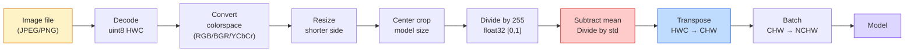
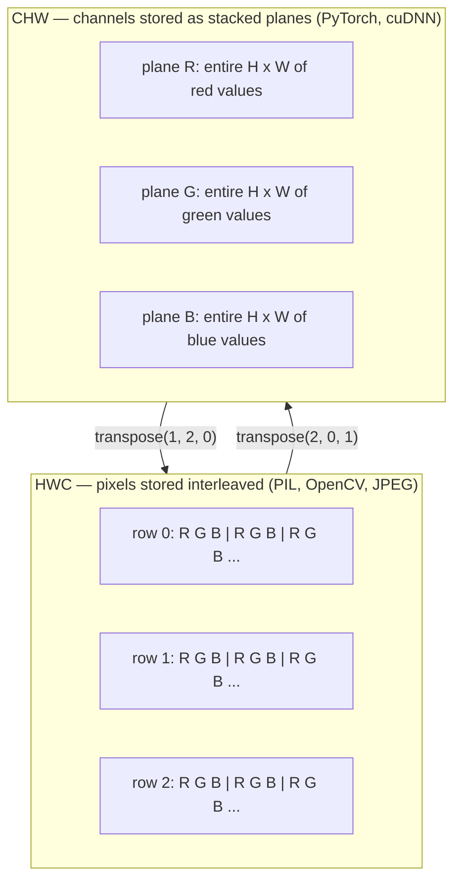

# Resim Temellikleri  Pikseller, Kanallar, Renk Alanları

> Bir görüntü, ışık örneklerinin bir tensörüdür. Kullandığınız her görüntü modeli bu tek gerçekten başlar.

**Type:** Build
**Languages:** Python
**Prerequisites:** Phase 1 Lesson 12 (Tensor Operations), Phase 3 Lesson 11 (Intro to PyTorch)
**Time:** ~45 minutes

## Öğrenme Hedefleri

- Sürekli bir sahne nasıl piksellere ayrılır ve örnekleme/kvantisalatma kararlarının her aşağı akımlı modelde tavan belirlemesini açıklayın.
- NumPy dizileri olarak görüntüleri okuyun, kesin ve kontrol edin ve HWC ve CHW düzenleri arasında akıcı olarak geçin
- RGB, gri ölçek, HSV ve YCbCr arasında dönüştürün ve her renk alanının neden var olduğunu açıklayın
- Piksel düzeyinde önceden işleme uygulayın (normalleştir, standartlaştır, boyutlandır, kanal önce) tam olarak torchvision beklediği gibi

## Sorun

Okuduğunuz her makale, indirdiğiniz her önceden eğitilmiş ağırlık, aradığınız her görüntü API'si girenin belirli bir kodlamasını varsayıyor.`uint8`Model istediği görüntü`float32`Bu da bir hata oluşturmaz. RGB'de eğitimli bir ağ için BGR'yi besleyin ve doğruluk on puan düşer. Bir model kanallar - kanalları beklediğinde son giriş - ilk ve ilk konfor katmanının yüksekliği bir özellik kanalı olarak ele alması. Bunların hiçbirisi hata atmaz. Sadece ölçümlerinizi mahvediyor ve dosyayı nasıl yüklediğinizde yaşayan bir hata için bir hafta avlarsınız.

Bir konvulsiyon, neyin kaydı olduğunu bildiğinizde karmaşık değildir. Zor kısmı, "bir görüntü" nin bir kamera, JPEG dekodörü, PIL, OpenCV, torchvision ve CUDA çekirdeği için farklı şeyler anlamına gelmesidir. Her yığının kendi eksis sırası, bayt aralığı ve kanal konvansiyonu vardır.

Bu ders temelini sabitler, böylece kalan aşama da buna dayanır. Sonuna kadar bir piksel ne olduğunu, bir piksel yerine neden üç sayı olduğunu, "ImageNet istatistikleriyle normalleştirmek"in aslında ne yaptığını ve bu aşamada diğer her dersinin öngördüğü iki veya üç düzen arasında nasıl hareket edeceğini bileceksiniz.

## Anlaşım

### Tüm önceden işleme boru hattı bir bakışta

Her üretim görme sistemi aynı dönüşümlü dönüşümler sırasıdır. Bir adım yanlış atarsan model eğitiminden farklı bir giriş görür.



İki kırmızı ve mavi kutuda sessiz başarısızlıkların %80'inin yaşadığı yerler: standartlaşmanın eksikliği ve yanlış düzenlemeler.

### Bir piksel bir örnek, bir kare değil.

Kamera sensörü, küçük detektörler arasında yer alan fotonları sayır. Her detektör saniyenin bir kısmında ışığı birleştirir ve ona çarpan foton sayısına orantılı bir voltaj yayar.

```
Continuous scene                 Sensor grid                     Digital image
(infinite detail)                (H x W detectors)               (H x W integers)

    ~~~~~                        +--+--+--+--+--+                 210 198 180 155 120
   # # # # # # # # # # # # # # # # # # # # # # # # # # # # # # # # # # # # # # # # # # # # # # # # # # # # # # # # # # # # # # # # # # # # # # # # # # # # # # # # # # # # # # # # # # # # # # # # # # # # # # # # # # # # # # # # # # # # # # # # # # # # # # # # # # # # # # # # # # # # # # # # # # # # # # # # # # # # # # # # # # # # # # # # # # # # # # # # # # # # # # # # # # # # # # # # # # # # # # # # # # # # # # # # # # # # # # # # # # # # # # # # # # # # # # # # # # # # # # # # # # # # # # # # # # # # # # # # # # # # # # # # # # # # # # # # # # # # # # # # # # # # # # # # # # # # # # # # # # # # # # # # # # # # # # # # # # # # # # # # # # # # # # # # # # # # # # # # # # # # # # # # # # # # # # # # # # # # # # # # # # # # # # # # # # # # # # # # # # # # # # # # # # # # # # # # # # # # # # # # # # # # # # # # # # # # # # # # # # # # # # # # # # # # # # # # # # # # # # # # # # # # # # # # # # # # # # # # # # # # # # # # # # # # # # # # # # # # # # # # # # # # # # # # # # # # # # # # # # # # # # # # # # # # # #
  - ...> +--+--+--+--+--+----> 200 190 175 150 115
   ~~~~~                         |  |  |  |  |  |                 195 185 170 148 112
                                 +--+--+--+--+--+                 188 180 165 145 108
```

Bu aşamada iki seçenek vardır ve aşağıdaki her şeyin tavanını düzeltirler:

- **Spatial sampling**Bu, bir sahne derecesine göre kaç detektör belirler. Çok az, kenarları bozulur. Çok fazla, depolama ve hesaplama patlar.
- **Intensity quantization**8 bit 256 seviye verir ve görüntüleme için standarttır. 10, 12, 16 bit tıbbi görüntüleme, HDR ve ham sensör boru hattları için daha düzgün bir kaydırma ve madde verir.

Bir piksel, alanı olan renkli bir kare değil. Tek bir ölçümdür. Boyut değiştirdiğinizde veya döndüğünüzde, ölçüm şebekesini yeniden örneklersiniz.

### Neden üç kanal?

Bir detektör, tüm görünür spektrumda foton sayır  yani gri ölçek. Renk elde etmek için, sensör, ağı kırmızı, yeşil ve mavi filtrelerin mozaikleriyle kaplar. Demosaik yapıldıktan sonra, her uzay konumunun üç tam sayı vardır: kırmızı filtreli detektörün tepkisi, yeşil filtreli ve mavi filtreli yakınlarda. Bu üç tam sayı bir piksel RGB üçlüdür.

```
One pixel in memory:

    (R, G, B) = (210, 140, 30)   <- reddish-orange

An H x W RGB image:

    shape (H, W, 3)     stored as   H rows of W pixels of 3 values
                                    each in [0, 255] for uint8
```

Üç sihirli değildir. Derinlik kameraları bir Z kanalı ekler. Uydular kızılötesi ve ultraviyole bantlar ekler. Tıbbi taramalar genellikle bir kanal (X-ışını, CT) veya birçok (hiperspektral) vardır. Kanal sayısı son eksendir; konv katmanları karışmayı öğrenir.

### İki düzenleme konferansı: HWC ve CHW

Aynı tenzor, iki sıralama.

```
HWC (height, width, channels)           CHW (channels, height, width)

   W ->                                    H ->
  +-----+-----+-----+                     +-----+-----+
H |R G B|R G B|R G B|                   C |R R R R R R|
| +-----+-----+-----+                   | +-----+-----+
v |R G B|R G B|R G B|                   v |G G G G G G|
  +-----+-----+-----+                     +-----+-----+
                                          |B B B B B B|
                                          +-----+-----+

   PIL, OpenCV, matplotlib,              PyTorch, most deep learning
   almost every image file on disk       frameworks, cuDNN kernels
```

CHW, konvulsiyon çekirdeklerinin H ve W'ye kaydırılması nedeniyle var. Kanal eksisini önce tutmak, her çekirdekin her kanal için bir bitişik 2 boyutlu düzlem görmesini, temiz bir şekilde vektörleştirmesini sağlar. Disk formatları HWC'yi tutar çünkü bu bir sensörden tarama çizgilerinin nasıl çıktığına uyuyor.

Tek satırlı dönüşümü bin kez yazacaksınız:

```
img_chw = img_hwc.transpose(2, 0, 1)      # NumPy
img_chw = img_hwc.permute(2, 0, 1)        # PyTorch tensor
```

Anıtlama düzenlemesi, görselleştirilmiş:



### Bayt aralıkları ve dtype

Üç büyük ibadetin baskısı:

| Convention | dtype | Range | Where you see it |
|------------|-------|-------|------------------|
| Raw | `uint8` | [0, 255] | Files on disk, PIL, OpenCV output |
| Normalized | `float32` | [0.0, 1.0] | After `img.astype('float32') / 255` |
| Standardized | `float32` | roughly [-2, +2] | After subtracting mean and dividing by std |

Konvülsiyonel ağlar standart girişler üzerinde eğitildi.`mean=[0.485, 0.456, 0.406]`- Evet .`std=[0.229, 0.224, 0.225]`Bu, üç kanalın tüm ImageNet eğitim kümesi üzerinde normalleştirilmiş piksellerle hesaplanan aritmetik ortalaması ve standart sapmasıdır.`uint8`Standartlaşmış yüzerlik bekleyen bir modelde uygulanan görmede en yaygın sessiz başarısızlık tekdir.

### Renk alanları ve neden var oldukları

RGB, yakalama biçimidir ancak bir model için her zaman en yararlı temsil değildir.

```
 RGB               HSV                       YCbCr / YUV

 R red             H hue (angle 0-360)       Y luminance (brightness)
 G green           S saturation (0-1)        Cb chroma blue-yellow
 B blue            V value/brightness (0-1)  Cr chroma red-green

 Linear to         Separates color from      Separates brightness from
 sensor output     brightness. Useful for    color. JPEG and most video
                   color thresholding, UI    codecs compress the chroma
                   sliders, simple filters   channels harder because the
                                             human eye is less sensitive
                                             to chroma detail than to Y.
```

Çoğu CNN'de RGB'yi beslerken diğer alanlarla karşılaşırken:

- **HSV** klasik CV kodu, renk tabanlı segmentasyon, beyaz dengeleme.
- **YCbCr** JPEG içsellerini, video boru hattlarını, sadece Y üzerinde çalışan süper çözünürlüklü modellerini okumak.
- **Grayscale** OCR, belge modelleri, renk sinyal yerine rahatsızlık değişken olduğu her durum.

RGB'den gri ölçek, ortalama değil, ağırlıklı bir toplamdır, çünkü insan gözü kırmızı veya maviye göre yeşilye daha duyarlıdır:

```
Y = 0.299 R + 0.587 G + 0.114 B       (ITU-R BT.601, the classic weights)
```

### Göreç oranı, boyut değiştirme ve interpolasyon

Her modelde sabit bir giriş boyutu vardır (224x224 çoğu ImageNet sınıflandırıcıları için, 384x384 veya 512x512 modern dedektörler için).

- **Resize shorter side, then center crop** Standart ImageNet tarifi. Görüntü oranını korur, kenar piksel çizgisini atır.
- **Resize and pad** boyut oranını ve her pikselini korur, siyah çubuklar ekler.
- **Resize directly to target**Bilgiyi uzatır, ucuz, geometriyi çarpıtır, birçok sınıflandırma görevi için iyi.

Interpolasyon yöntemi, yeni şebekenin eski şebekeninle uyumlu olmadığı zaman ara pikselilerin nasıl hesaplandığını belirler:

```
Nearest neighbour     fastest, blocky, only choice for masks/labels
Bilinear              fast, smooth, default for most image resizing
Bicubic               slower, sharper on upscaling
Lanczos               slowest, best quality, used for final display
```

Basamak kural: eğitim için binlinear, bakılacak varlık için iki küp veya lanczos, tam sayı sınıfı kimlikleri içeren herhangi bir şey için en yakın.

```figure
conv-output-size
```

## Yapın

### Adım 1: Bir resim yükle ve şeklini kontrol et

Yastık kullanın herhangi bir JPEG veya PNG yüklemek, NumPy'ye dönüştürmek ve elde ettiğiniz şeyi basmak için.

```python
import numpy as np
from PIL import Image

def synthetic_rgb(h=128, w=192, seed=0):
    rng = np.random.default_rng(seed)
    yy, xx = np.meshgrid(np.linspace(0, 1, h), np.linspace(0, 1, w), indexing="ij")
    r = (np.sin(xx * 6) * 0.5 + 0.5) * 255
    g = yy * 255
    b = (1 - yy) * xx * 255
    rgb = np.stack([r, g, b], axis=-1) + rng.normal(0, 6, (h, w, 3))
    return np.clip(rgb, 0, 255).astype(np.uint8)

arr = synthetic_rgb()
# Or load from disk:
# arr = np.asarray(Image.open("your_image.jpg").convert("RGB"))

print(f"type:   {type(arr).__name__}")
print(f"dtype:  {arr.dtype}")
print(f"shape:  {arr.shape}     # (H, W, C)")
print(f"min:    {arr.min()}")
print(f"max:    {arr.max()}")
print(f"pixel at (0, 0): {arr[0, 0]}")
```

Beklenen üretim: `shape: (H, W, 3)`- Evet .`dtype: uint8`, aralığı `[0, 255]`Bu, baytların bir kamera, JPEG dekodör veya sentetik jeneratörden geldiği için disk üzerinde kanonik temsil.

### Adım 2: Çanakları bölün ve yeniden düzenlen

R, G, B'yi ayrı ayrı çıkarın ve sonra PyTorch için HWC'den CHW'ye dönüştürün.

```python
R = arr[:, :, 0]
G = arr[:, :, 1]
B = arr[:, :, 2]
print(f"R shape: {R.shape}, mean: {R.mean():.1f}")
print(f"G shape: {G.shape}, mean: {G.mean():.1f}")
print(f"B shape: {B.shape}, mean: {B.mean():.1f}")

arr_chw = arr.transpose(2, 0, 1)
print(f"\nHWC shape: {arr.shape}")
print(f"CHW shape: {arr_chw.shape}")
```

CHW sadece ekseleri yeniden düzenler; hafıza düzenlemesi izin verdiğinde hiçbir veri kopyası zorunlu olarak gerekmez.

### Adım 3: Gri ölçek ve HSV dönüşümleri

Ağırlıklı toplam gri ölçek, sonra da RGB-HSV manuel.

```python
def rgb_to_grayscale(rgb):
    weights = np.array([0.299, 0.587, 0.114], dtype=np.float32)
    return (rgb.astype(np.float32) @ weights).astype(np.uint8)

def rgb_to_hsv(rgb):
    rgb_f = rgb.astype(np.float32) / 255.0
    r, g, b = rgb_f[..., 0], rgb_f[..., 1], rgb_f[..., 2]
    cmax = np.max(rgb_f, axis=-1)
    cmin = np.min(rgb_f, axis=-1)
    delta = cmax - cmin

    h = np.zeros_like(cmax)
    mask = delta > 0
    rmax = mask & (cmax == r)
    gmax = mask & (cmax == g)
    bmax = mask & (cmax == b)
    h[rmax] = ((g[rmax] - b[rmax]) / delta[rmax]) % 6
    h[gmax] = ((b[gmax] - r[gmax]) / delta[gmax]) + 2
    h[bmax] = ((r[bmax] - g[bmax]) / delta[bmax]) + 4
    h = h * 60.0

    s = np.where(cmax > 0, delta / cmax, 0)
    v = cmax
    return np.stack([h, s, v], axis=-1)

gray = rgb_to_grayscale(arr)
hsv = rgb_to_hsv(arr)
print(f"gray shape: {gray.shape}, range: [{gray.min()}, {gray.max()}]")
print(f"hsv   shape: {hsv.shape}")
print(f"hue range: [{hsv[..., 0].min():.1f}, {hsv[..., 0].max():.1f}] degrees")
print(f"sat range: [{hsv[..., 1].min():.2f}, {hsv[..., 1].max():.2f}]")
print(f"val range: [{hsv[..., 2].min():.2f}, {hsv[..., 2].max():.2f}]")
```

Hue dereceler, doymak ve değer olarak çıkar.`hsv_full`Anlaşma.

### Dördüncü adım: Normalleştir, standartlaştır ve tersine çevir

Çizil baytlardan, önceden eğitilmiş bir ImageNet modeli beklediği tam tensora git ve sonra geri dön.

```python
mean = np.array([0.485, 0.456, 0.406], dtype=np.float32)
std = np.array([0.229, 0.224, 0.225], dtype=np.float32)

def preprocess_imagenet(rgb_uint8):
    x = rgb_uint8.astype(np.float32) / 255.0
    x = (x - mean) / std
    x = x.transpose(2, 0, 1)
    return x

def deprocess_imagenet(chw_float32):
    x = chw_float32.transpose(1, 2, 0)
    x = x * std + mean
    x = np.clip(x * 255.0, 0, 255).astype(np.uint8)
    return x

x = preprocess_imagenet(arr)
print(f"preprocessed shape: {x.shape}     # (C, H, W)")
print(f"preprocessed dtype: {x.dtype}")
print(f"preprocessed mean per channel:  {x.mean(axis=(1, 2)).round(3)}")
print(f"preprocessed std  per channel:  {x.std(axis=(1, 2)).round(3)}")

roundtrip = deprocess_imagenet(x)
max_diff = np.abs(roundtrip.astype(int) - arr.astype(int)).max()
print(f"roundtrip max pixel diff: {max_diff}    # should be 0 or 1")
```

Kanal başına ortalama sıfır, std bir yakın olmalıdır.`transforms.Normalize`Telefon, kapuk altında.

### Adım 5: Üç interpolasyon yöntemiyle yeniden boyutlandır

En yakın, iki çizgilik ve iki küplik bir ölçekle karşılaştırın, fark görülebilir.

```python
target = (arr.shape[0] * 3, arr.shape[1] * 3)

nearest = np.asarray(Image.fromarray(arr).resize(target[::-1], Image.NEAREST))
bilinear = np.asarray(Image.fromarray(arr).resize(target[::-1], Image.BILINEAR))
bicubic = np.asarray(Image.fromarray(arr).resize(target[::-1], Image.BICUBIC))

def local_roughness(x):
    gy = np.diff(x.astype(float), axis=0)
    gx = np.diff(x.astype(float), axis=1)
    return float(np.abs(gy).mean() + np.abs(gx).mean())

for name, out in [("nearest", nearest), ("bilinear", bilinear), ("bicubic", bicubic)]:
    print(f"{name:>8}  shape={out.shape}  roughness={local_roughness(out):6.2f}")
```

En yakınları sertlik oranında en yüksek puanlar verir çünkü sert kenarları tutar. Bilineer en nemlidir.

## Kullan

`torchvision.transforms`Aşağıdaki kod tam olarak neyi yansıtır.`preprocess_imagenet`Evet, artı boyutlandırma ve biçim.

```python
import torch
from torchvision import transforms
from PIL import Image

img = Image.fromarray(synthetic_rgb(256, 256))

pipeline = transforms.Compose([
    transforms.Resize(256),
    transforms.CenterCrop(224),
    transforms.ToTensor(),
    transforms.Normalize(mean=[0.485, 0.456, 0.406], std=[0.229, 0.224, 0.225]),
])

x = pipeline(img)
print(f"tensor type:  {type(x).__name__}")
print(f"tensor dtype: {x.dtype}")
print(f"tensor shape: {tuple(x.shape)}      # (C, H, W)")
print(f"per-channel mean: {x.mean(dim=(1, 2)).tolist()}")
print(f"per-channel std:  {x.std(dim=(1, 2)).tolist()}")

batch = x.unsqueeze(0)
print(f"\nbatched shape: {tuple(batch.shape)}   # (N, C, H, W) — ready for a model")
```

Dört adım, tam olarak bu sırada:`Resize(256)`256'a kadar daha kısa tarafı ölçeyor. `CenterCrop(224)`Orta tarafta 224x224 yama alır .`ToTensor()`255 ile bölünür ve HWC'yi CHW'ye değiştirir; `Normalize`ImageNet ortalamasını çıkarır ve std ile bölür. Bu sırayı ters çevirmek, modelin ulaştığını sessizce değiştirir.

## Gönder

Bu ders şunları ortaya çıkarır:

- `outputs/prompt-vision-preprocessing-audit.md` herhangi bir model kartı veya veri kümesi kartını bir takımın yerine getirmesi gereken tam önceden işleme değişkenlerinin kontrol listesine dönüştüren bir istek.
- `outputs/skill-image-tensor-inspector.md` herhangi bir görüntü şeklinde tensor veya dizi verildiğinde dtip, düzen, aralığı ve çiğ, normalleştirilmiş veya standartlaştırılmış görünüşü rapor eden bir beceri.

## Egzersizler

1. **(Easy)**OpenCV ile JPEG yükle (`cv2.imread`İki şekli de, piksel de basın.`(0, 0)`Kanal-sıra farkını açıklayın, sonra OpenCV dizini Yastık dizisi ile aynı hale getiren tek satırlı bir dönüşüm yazın.
2. **(Medium)**Yazmın .`standardize(img, mean, std)`ve bunun tersine birlikte bir `roundtrip_max_diff <= 1`Uint8 görüntülerini test et. fonksiyonlarınız HWC'deki tek bir görüntüde ve aynı çağrı ile NCHW'deki bir partide çalışmalıdır.
3. **(Hard)**3 kanallı ImageNet standartlaştırılmış bir tensör alın ve RGB'nin ağırlıklı karışımını bir gri ölçekli kanal olarak öğrenen 1x1 konforu üzerinden çalıştırın.`[0.299, 0.587, 0.114]`, dondur ve çıkışın el kitabına uyuyor olduğunu kontrol et.`rgb_to_grayscale`Hangi klasik renk- uzay dönüşümleri 1x1 dönüşümleri olarak yazılabilir?

## Anahtar Terimler

| Term | What people say | What it actually means |
|------|----------------|----------------------|
| Pixel | "A coloured square" | One sample of light intensity at one grid location — three numbers for colour, one for grayscale |
| Channel | "The colour" | One of the parallel spatial grids stacked into an image tensor; last axis in HWC, first in CHW |
| HWC / CHW | "The shape" | Axis orderings for an image tensor; disk and PIL use HWC, PyTorch and cuDNN use CHW |
| Normalize | "Scale the image" | Divide by 255 so pixels live in [0, 1] — necessary but not sufficient |
| Standardize | "Zero-center" | Subtract mean and divide by std per channel so the input distribution matches what the model was trained on |
| Grayscale conversion | "Average the channels" | A weighted sum with coefficients 0.299/0.587/0.114 that matches human luminance perception |
| Interpolation | "How resize picks pixels" | The rule that decides output values when the new grid does not align with the old one — nearest for labels, bilinear for training, bicubic for display |
| Aspect ratio | "Width over height" | The ratio that distinguishes "resize and pad" from "resize and stretch" |

## Daha Fazla Okumak

- [Charles Poynton — A Guided Tour of Color Space](https://poynton.ca/PDFs/Guided_tour.pdf) rengin neden bu kadar çok olduğunu ve her birinin ne zaman önemli olduğunu açık bir teknik tedavi
- [PyTorch Vision Transforms Docs](https://pytorch.org/vision/stable/transforms.html) üretim sırasında oluşturduğunuz transformasyonların tüm hattı
- [How JPEG Works (Colt McAnlis)](https://www.youtube.com/watch?v=F1kYBnY6mwg) krom alt örnekleme, DCT'nin keskin bir görsel turunu ve JPEG'nin RGB yerine YCbCr'yi neden kodlaması
- [ImageNet Preprocessing Conventions (torchvision models)](https://pytorch.org/vision/stable/models.html) gerçeğin kaynağı`mean=[0.485, 0.456, 0.406]`ve hayvanat bahçesindeki her model neden bunu bekliyor?
